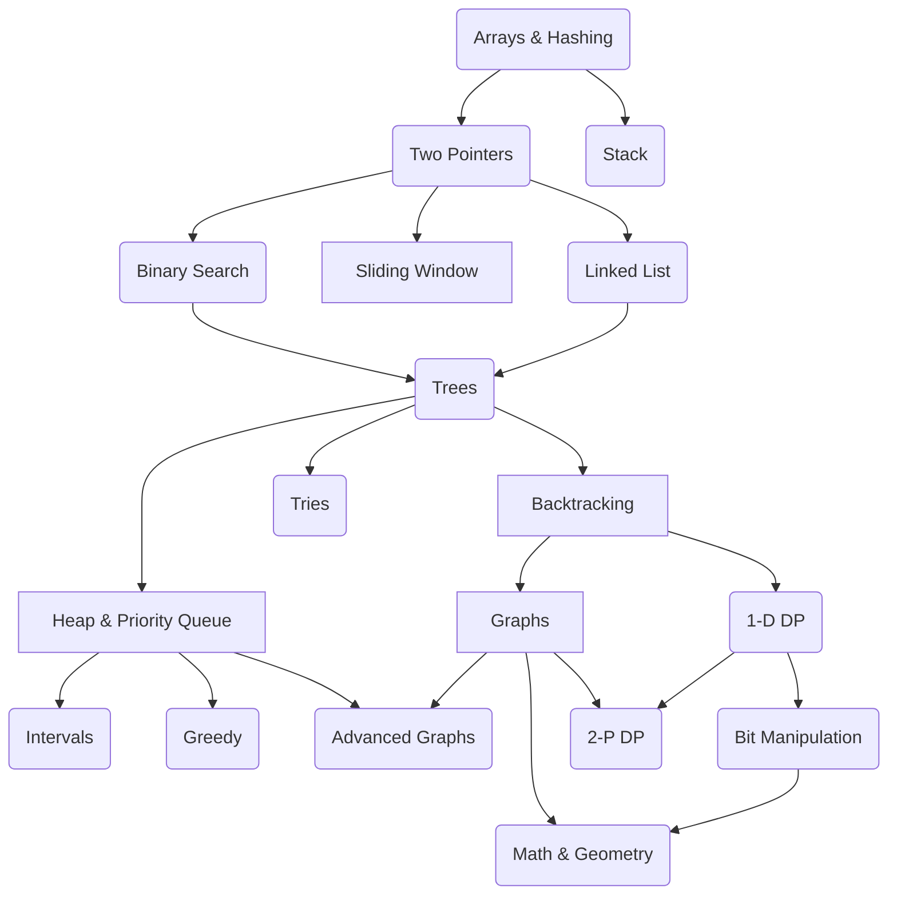

# Java Local Development ☕️

This is a Sandbox environment to practice my Java skills. I'm following the NeetCode roadmap. 

The NeetCode roadmap is a super useful guide designed to help you master coding interviews. It lays out a clear, 
step-by-step plan to learn important data structures and algorithms, starting from beginner-friendly concepts and 
working up to more advanced ones. The idea is to give you a structured path to follow, with curated problems from 
LeetCode that you can practice along the way.

All credit to [Navdeep Singh](https://www.youtube.com/@NeetCode). 
 Thank you 🙏 Navdeep for your work !

[https://neetcode.io/roadmap](https://neetcode.io/roadmap)

## Problems

### Arrays & Hashing

| Problem                                                                                    | Difficulty | Java Class                                                                                |
|--------------------------------------------------------------------------------------------|------------|-------------------------------------------------------------------------------------------|
| [Contains Duplicate](https://leetcode.com/problems/contains-duplicate)                     | Easy       | [ContainsDuplicate.java](src/main/java/org/example/arrays/ContainsDuplicate.java)         |
| [Valid Anagram](https://leetcode.com/problems/valid-anagram)                               | Easy       | [ValidAnagram.java](src/main/java/org/example/arrays/ValidAnagram.java)                   |
| [Two Sum](https://leetcode.com/problems/two-sum)                                           | Easy       | [TwoSum.java](src/main/java/org/example/arrays/TwoSum.java)                               |
| [Group Anagrams](https://leetcode.com/problems/group-anagrams)                             | Medium     | [GroupAnagrams.java](src/main/java/org/example/arrays/GroupAnagrams.java)                 |
| [Top K Frequent Elements](https://leetcode.com/problems/top-k-frequent-elements)           | Medium     | [TopKFrequent.java](src/main/java/org/example/arrays/TopKFrequent.java)                   |
| [Encode and Decode Strings](https://leetcode.com/problems/encode-and-decode-strings)       | Medium     | [EncodeDecode.java](src/main/java/org/example/arrays/EncodeDecode.java)                   |
| [Product of Array Except Self](https://leetcode.com/problems/product-of-array-except-self) | Medium     | [ProductExcept.java](src/main/java/org/example/arrays/ProductExcept.java)                 |
| [Valid Sudoku](https://leetcode.com/problems/valid-sudoku)                                 | Medium     | [ValidSudoku.java](src/main/java/org/example/arrays/ValidSudoku.java)                     |
| [Longest Consecutive Sequence](https://leetcode.com/problems/longest-consecutive-sequence) | Medium     | [LongestConsecutiveSeq.java](src/main/java/org/example/arrays/LongestConsecutiveSeq.java) |

### Stack

| Problem                                                                                            | Difficulty | Java Class                                                                                            |
|----------------------------------------------------------------------------------------------------|------------|-------------------------------------------------------------------------------------------------------|
| [Valid Parentheses](https://leetcode.com/problems/valid-parentheses)                               | Easy       | [ValidParentheses.java](src/main/java/org/example/stacks/ValidParentheses.java)                       |
| [Min Stack](https://leetcode.com/problems/min-stack)                                               | Medium     | [MinStack.java](src/main/java/org/example/stacks/MinStack.java)                                       |
| [Evaluate Reverse Polish Notation](https://leetcode.com/problems/evaluate-reverse-polish-notation) | Medium     | [ReversePolish.java](src/main/java/org/example/stacks/ReversePolish.java)                             |
| [Generate Parentheses](https://leetcode.com/problems/generate-parentheses)                         | Medium     | [GenerateParentheses.java](src/main/java/org/example/stacks/GenerateParentheses.java)                 |
| [Daily Temperatures](https://leetcode.com/problems/daily-temperatures)                             | Medium     | [DailyTemperatures.java](src/main/java/org/example/stacks/DailyTemperatures.java)                     |
| [Car Fleet](https://leetcode.com/problems/car-fleet)                                               | Medium     | [CarFleet.java](src/main/java/org/example/stacks/CarFleet.java)                                       |
| [Largest Rectangle In Histogram](https://leetcode.com/problems/largest-rectangle-in-histogram)     | Hard       | [LargestRectangleInHistogram.java](src/main/java/org/example/stacks/LargestRectangleInHistogram.java) |
