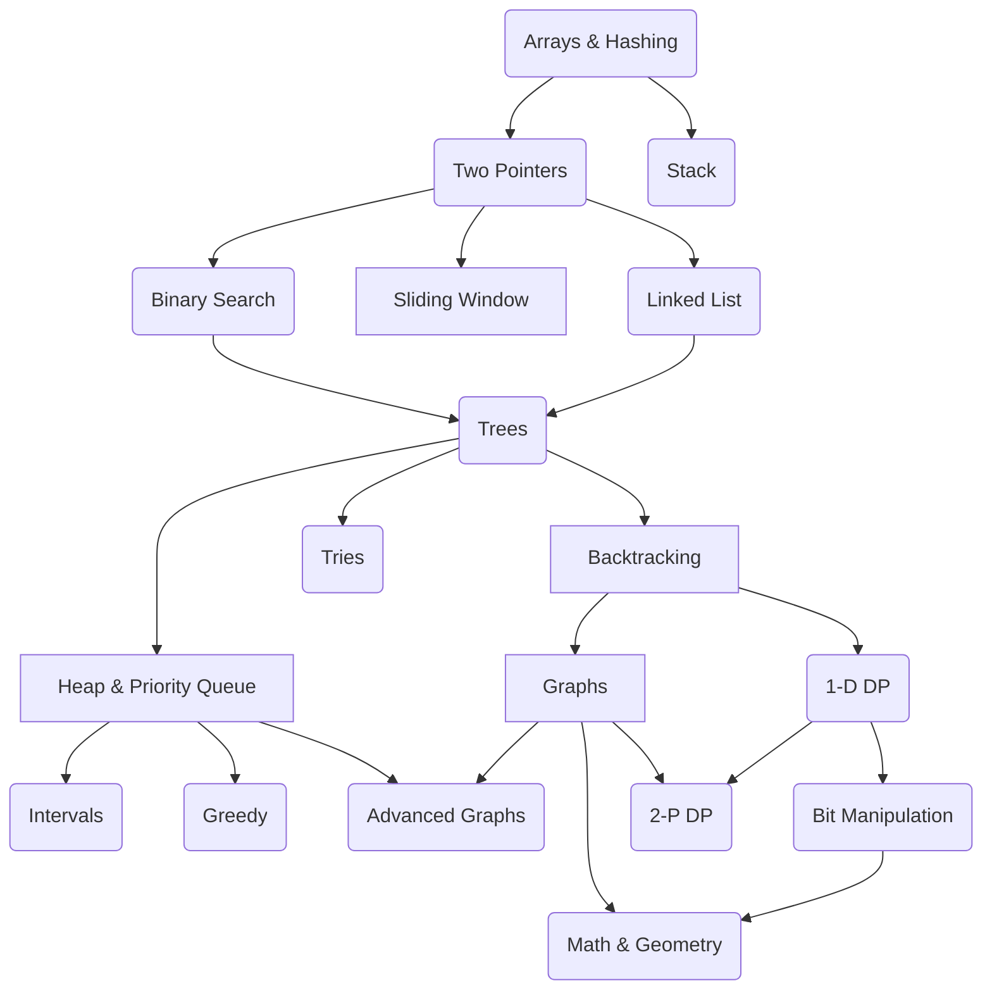

# Java Local Development

The NeetCode roadmap is a super useful guide designed to help you master coding interviews. It lays out a clear, 
step-by-step plan to learn important data structures and algorithms, starting from beginner-friendly concepts and 
working up to more advanced ones. The idea is to give you a structured path to follow, with curated problems from 
LeetCode that you can practice along the way.

All credit to [Navdeep Singh](https://www.youtube.com/@NeetCode). 
 Thank you 🙏 Navdeep for your work !

[https://neetcode.io/roadmap](https://neetcode.io/roadmap)

